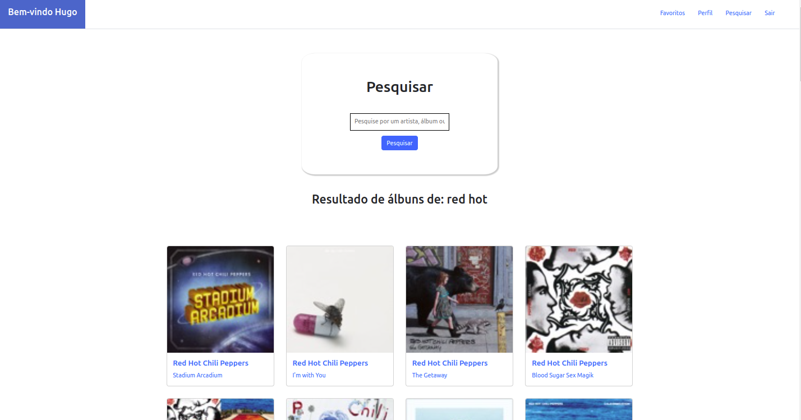

# Projeto TrybeWarts
 
# Contexto
 
Neste projeto foi desenvolvida uma aplicação em React capaz de reproduzir músicas das mais variadas bandas e artistas, criar uma lista de músicas favoritas e editar o perfil da pessoa usuária logada. Essa aplicação será capaz de:

*  Fazer login;
* Pesquisar por uma banda ou artista;
* Listar os álbuns disponíveis dessa banda ou artista;
* Visualizar as músicas de um álbum selecionado;
* Reproduzir uma prévia das músicas deste álbum;
* Favoritar e desfavoritar músicas;
* Ver a lista de músicas favoritas(Funcionalidade ainda não implementada);
* Ver o perfil da pessoa logada(Funcionalidade ainda não implementada);
* Editar o perfil da pessoa logada(Funcionalidade ainda não implementada);


### Hugo de Sousa Silva
linkedin: https://www.linkedin.com/in/hugo-de-sousa-dev/

#



[Acesse o site aqui.](https://hugodesousa.github.io/trybe-tunes/#/)

## Tecnologias usadas

Front-end:
> Desenvolvido com HTML, CSS e JavaScript.
> React, bootstrap
 
#
## Executando aplicação
 
* Para o site direto no navegador:
 
 ```
  https://hugodesousa.github.io/trybe-tunes/#/
 ```
* Para rodar em uma máquina local
 
 ```
   No terminal rodar os comandos:
 ```
 ```
   git clone git@github.com:Hugodesousa/trybe-tunes.git
 ```
 ```
   cd trybe-tunes

 ```
 ```
   npm install
 ```
 ```
   npm start
 ```
#
### Projeto base fornecido pela Trybe
https://www.betrybe.com/
